# SQLChange — LangGraph Pipeline Architecture

## Full System Graph

```mermaid
flowchart TD
    START([" User SQL query"]) --> PARSE

    PARSE["<b>Parse & extract</b><br/>sqlglot AST traversal<br/>tables, columns, joins, WHERE"]
    PARSE --> CONTEXT_CHECK{"DDL provided?"}

    CONTEXT_CHECK -->|"yes"| PARSE_SQL["<b>parse_sql()</b><br/>DDL → full schema<br/>100% accurate"]
    CONTEXT_CHECK -->|"no"| INFER["<b>infer_context_from_query()</b><br/>scope-aware inference<br/>~85-90% accurate"]

    PARSE_SQL --> TABLE_PARSER
    INFER --> TABLE_PARSER

    subgraph ER [" ER graph builder — graph_representer.py"]
        direction TB
        TABLE_PARSER["<b>Table parser</b><br/>Extract table names from context"]
        TABLE_PARSER --> JOIN_CHECK{"Join keys<br/>present?"}
        JOIN_CHECK -->|"yes"| PYTHON_NODE["<b>Python node</b><br/>Direct extraction from ON clauses<br/>confidence: high"]
        JOIN_CHECK -->|"no"| LLM_INFER["<b>LLM inference</b><br/>Infer from naming conventions<br/> LLM call 1"]
        PYTHON_NODE --> BUILD_ER["<b>Build ER graph</b><br/>table importance · graph depth<br/>cross-table risk detection"]
        LLM_INFER --> BUILD_ER
    end

    BUILD_ER --> BUILD_DATASET

    subgraph EXEC ["Execution harness"]
        direction TB
        BUILD_DATASET["<b>Build dataset</b><br/>synthetic_db → in-memory SQLite<br/>configurable: small / large"]
        BUILD_DATASET --> TIME_COMP["<b>Time comparison</b><br/>Run original vs modified<br/>row count · runtime · output relation"]
    end

    TIME_COMP --> REASONING

    subgraph LABEL ["Labeling pipeline"]
        direction TB
        REASONING["<b>Reasoning</b><br/>Deterministic rules first<br/> LLM call 2 — refine labels"]
        REASONING --> PERF & RISK
        PERF["<b>Performance</b><br/>improves · degrades<br/>neutral · unknown"]
        RISK["<b>Risk</b><br/>low · medium · high"]
        PERF --> SEMANTIC
        RISK --> SEMANTIC
        SEMANTIC["<b>Semantic</b><br/>equivalent · narrower<br/>broader · different"]
    end

    SEMANTIC --> RECOMMEND

    RECOMMEND["<b>Recommend</b><br/>Suggest optimized query<br/> LLM call 3"]
    RECOMMEND --> LOOP_CHECK{"Iteration < N?"}

    LOOP_CHECK -->|"yes — re-test"| BUILD_DATASET
    LOOP_CHECK -->|"done"| FINAL_OUTPUT([" Final output<br/>labels + recommendation"])

    style START fill:#f0f0f0,stroke:#888,color:#333
    style FINAL_OUTPUT fill:#f0f0f0,stroke:#888,color:#333
    style CONTEXT_CHECK fill:#fff3cd,stroke:#d4a017,color:#333
    style JOIN_CHECK fill:#fff3cd,stroke:#d4a017,color:#333
    style LOOP_CHECK fill:#fff3cd,stroke:#d4a017,color:#333
    style PARSE fill:#e8daef,stroke:#8e44ad,color:#333
    style PARSE_SQL fill:#d5f5e3,stroke:#1e8449,color:#333
    style INFER fill:#d5f5e3,stroke:#1e8449,color:#333
    style TABLE_PARSER fill:#e8daef,stroke:#8e44ad,color:#333
    style PYTHON_NODE fill:#d5f5e3,stroke:#1e8449,color:#333
    style LLM_INFER fill:#fadbd8,stroke:#c0392b,color:#333
    style BUILD_ER fill:#e8daef,stroke:#8e44ad,color:#333
    style BUILD_DATASET fill:#d6eaf8,stroke:#2471a3,color:#333
    style TIME_COMP fill:#d6eaf8,stroke:#2471a3,color:#333
    style REASONING fill:#fadbd8,stroke:#c0392b,color:#333
    style PERF fill:#fdebd0,stroke:#d4a017,color:#333
    style RISK fill:#fadbd8,stroke:#c0392b,color:#333
    style SEMANTIC fill:#d5f5e3,stroke:#1e8449,color:#333
    style RECOMMEND fill:#d5f5e3,stroke:#1e8449,color:#333
    style ER fill:#f5eef8,stroke:#8e44ad,color:#333
    style EXEC fill:#eaf2f8,stroke:#2471a3,color:#333
    style LABEL fill:#fdf2f2,stroke:#c0392b,color:#333
```

## Color Legend

| Color | Meaning |
|-------|---------|
| 🟣 Purple | Parsing & graph building (sqlglot + LangGraph) |
| 🟢 Green | Schema extraction & output nodes |
| 🔵 Blue | Execution harness (synthetic data + timing) |
| 🔴 Red | LLM-dependent nodes |
| 🟡 Yellow | Conditional routing (decision points) |

## Node Details

### Parse & extract
Receives the user's raw SQL query. Uses `sqlglot` to parse the AST and extract table names, column references, join keys (`get_join_keys`), and WHERE dependencies (`get_where_details`).

### Context routing
Conditional edge checking whether DDL (CREATE TABLE statements) was provided alongside the query. If yes, `parse_sql()` extracts the full schema with all columns and exact types. If no, `infer_context_from_query()` uses `sqlglot.optimizer.scope.traverse_scope` for scope-aware inference — correctly handles subqueries, CTEs, UNIONs, and derived tables.

### ER graph sub-graph
The `graph_representer.py` LangGraph pipeline. Parses table names from the context, then routes conditionally: if explicit join keys exist, a Python node extracts relationships directly from ON clauses (high confidence). If no join keys exist but multiple tables are present, an LLM call infers likely relationships from column naming conventions. Both paths converge into the graph builder, which assigns table importance levels (root / intermediate / leaf), detects cross-table WHERE dependencies, and computes graph depth.
### Build dataset
Generates synthetic test data using `synthetic_db.py`. Creates in-memory SQLite tables from the context dict, populates them with deterministic fake data (seeded RNG), applies join-value alignment so foreign keys match, and injects WHERE boundary values so filters have both passing and failing rows. Supports configurable scale (small / large row counts per table).

### Time comparison
Runs the original and modified SQL queries against the synthetic database. Measures runtime (median over N repeats), row counts, and output relation (identical / narrower / broader / different / error). Returns structured comparison evidence for downstream reasoning.

### Reasoning
Applies deterministic rule-based classification first (`reasoning_pipeline.py`), producing semantic, performance, and risk labels with confidence scores and rationales. Optionally refines labels via an LLM call that reviews the rule output against the full record evidence.

### Performance / Risk / Semantic
Three parallel label dimensions:

| Dimension | Labels | Signals used |
|-----------|--------|-------------|
| **Performance** | `improves` · `degrades` · `neutral` · `unknown` | Speedup ratio, runtime delta across scales |
| **Risk** | `low` · `medium` · `high` | Cross-table risk, graph depth, join count, WHERE dependency count |
| **Semantic** | `equivalent` · `narrower` · `broader` · `different` | Row count delta, output relation from execution harness |

### Recommend
Takes all labels, the original query, the modified query, and the ER graph context. Uses an LLM call to suggest an optimized version of the query that addresses the identified risks and performance concerns.

### Iteration loop
If iteration count is below the configured threshold N, the recommended query feeds back into Build Dataset as the new modified query and the pipeline re-evaluates it. This allows iterative refinement until convergence or max iterations.

## LLM Calls

The pipeline makes up to 3 LLM calls per iteration:

| Call | Node | Purpose | Provider support |
|------|------|---------|-----------------|
| 1 | ER graph (conditional) | Infer table relationships when no join keys exist | Anthropic · OpenAI · Ollama |
| 2 | Reasoning | Refine rule-based labels with rationale | Anthropic · OpenAI · Ollama |
| 3 | Recommend | Generate optimized query suggestion | Anthropic · OpenAI · Ollama |

All LLM calls use the provider-agnostic `llm_universal_call_utility()` supporting Anthropic, OpenAI, and local Ollama models.