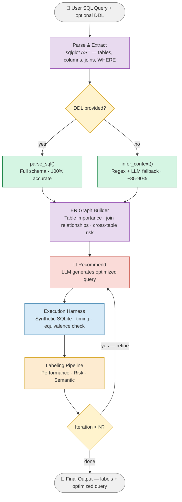

# SQLChange

**LLM-Powered SQL Query Optimization Pipeline with Iterative Refinement**

`Python` `LangGraph` `sqlglot` `Ollama` `SQLite` `UC Davis`

Automatically analyze, label, and optimize SQL queries using a multi-stage LangGraph pipeline — combining AST-based static analysis, synthetic execution testing, and LLM-driven rewriting to produce faster, safer queries without manual tuning.

---

## Architecture Overview



> 🟣 Parsing & graph building &nbsp; 🟢 Schema extraction &nbsp; 🔵 Execution harness &nbsp; 🔴 LLM-dependent &nbsp; 🟡 Decision points

Each iteration feeds performance, risk, and semantic labels back into the recommender, allowing the LLM to progressively refine the query until it converges on an optimal result or reaches the iteration cap. The pipeline makes up to 3 LLM calls per iteration: ER relationship inference (conditional), label refinement, and query recommendation.

## How It Works

**Parse & Extract** — sqlglot AST traversal extracts tables, columns, join keys, and WHERE dependencies. If DDL is provided, schema extraction is 100% accurate; without DDL, a regex extractor with LLM fallback infers the schema (~85–90% accuracy).

**ER Graph Builder** — Constructs an entity-relationship graph with table importance hierarchy (root / intermediate / leaf) and cross-table risk detection. Join relationships are extracted directly from ON clauses when available, or inferred by the LLM from naming conventions.

**Recommendation Engine** — The LLM receives full upstream context (schema, ER graph, execution evidence, prior labels) and generates an optimized SQL query. Recommendations are validated against sqlglot and checked for SQLite dialect compatibility.

**Execution Harness** — Builds a synthetic in-memory SQLite database from the inferred schema, executes both original and recommended queries at multiple data scales (50 and 2,000 rows), and measures timing and output equivalence.

**Labeling Pipeline** — Three independent classifiers score the recommended query using deterministic rules first, then LLM refinement for nuanced cases:

| Labeler     | Output                                         | Score   |
|-------------|-------------------------------------------------|---------|
| Performance | improves · degrades · neutral · unknown         | 0–10    |
| Risk        | low · medium · high                             | 0–10    |
| Semantic    | equivalent · narrower · broader · different     | —       |

**Iteration Control** — The pipeline loops back to the recommender if performance can improve or risk can decrease, stopping when the query reaches optimal thresholds (performance ≥ 8, risk ≤ 3), the LLM returns `keep_original`, or the iteration cap is hit.

## Example: HR Analytics Query (Qwen 7B)

Input query with **6 intentional anti-patterns**: `SELECT DISTINCT e.*`, N+1 scalar subqueries, unsafe `NOT IN` with potential NULLs, `UPPER()` on a column preventing index usage, correlated `AVG` subquery, and redundant joins masked by `DISTINCT`.

```sql
SELECT DISTINCT e.*, d.dept_name,
  (SELECT COUNT(*) FROM assignments a2 WHERE a2.employee_id = e.id) AS project_count,
  (SELECT SUM(hours_worked) FROM assignments a3 WHERE a3.employee_id = e.id) AS total_hours
FROM employees e
LEFT JOIN departments d ON e.department_id = d.id
LEFT JOIN assignments a ON a.employee_id = e.id
LEFT JOIN projects p ON p.id = a.project_id
WHERE e.is_active = 1
  AND e.id NOT IN (
    SELECT employee_id FROM assignments
    WHERE project_id IN (SELECT id FROM projects WHERE status = 'cancelled')
  )
  AND UPPER(d.dept_name) != 'TEMP'
  AND e.salary > (SELECT AVG(salary) FROM employees WHERE department_id = e.department_id)
ORDER BY e.salary DESC
```

After 3 iterations, Qwen 2.5 Coder 7B fixes **3 of 6 anti-patterns** — replacing `SELECT DISTINCT e.*` with explicit columns, converting scalar subqueries into JOINs with `GROUP BY`, and removing the redundant joins that required `DISTINCT`:

```sql
SELECT
  e.id, e.name, e.salary, d.dept_name,
  COUNT(a2.employee_id) AS project_count,
  SUM(a3.hours_worked)  AS total_hours
FROM employees AS e
LEFT JOIN departments AS d  ON e.department_id = d.id
LEFT JOIN assignments  AS a2 ON e.id = a2.employee_id
LEFT JOIN assignments  AS a3 ON e.id = a3.employee_id
WHERE e.is_active = 1
  AND UPPER(d.dept_name) <> 'TEMP'
  AND e.salary > (
    SELECT AVG(salary) FROM employees WHERE department_id = e.department_id
  )
GROUP BY e.id, e.name, e.salary, d.dept_name
ORDER BY e.salary DESC
```

Remaining anti-patterns (`NOT IN` → `NOT EXISTS`, `UPPER()` on column, correlated `AVG` subquery) would require a larger model or manual review — the pipeline's risk and semantic labels flag these for the developer.

## Interfaces

### CLI

```bash
# Direct input
python cli.py "SELECT * FROM orders o JOIN customers c ON o.customer_id = c.id"

# With DDL schema
python cli.py --ddl "CREATE TABLE orders (id INT, total DECIMAL);" "SELECT * FROM orders"

# From files
python cli.py --file query.sql --ddl-file schema.sql --iterations 5

# Interactive mode
python cli.py --interactive

# JSON output for scripting
python cli.py --json "SELECT * FROM orders" | jq .recommended_sql
```

### HTTP API

```bash
python api.py --port 5000

curl -X POST http://localhost:5000/optimize \
  -H "Content-Type: application/json" \
  -d '{"sql": "SELECT * FROM orders WHERE total > 100", "max_iterations": 3}'
```

### Python API

```python
from pipeline import run_pipeline

result = run_pipeline(
    original_sql="SELECT * FROM orders WHERE total > 100",
    ddl_context="CREATE TABLE orders (id INT, total DECIMAL, name TEXT);",
    provider="qwen",
    max_iterations=3,
)

print(f"Performance: {result['performance_label']['label']} ({result['performance_label']['score']}/10)")
print(f"Risk: {result['risk_label']['label']} ({result['risk_label']['score']}/10)")
print(f"Semantic: {result['semantic_label']['label']}")
```

## Dataset

110 curated SQL queries sourced from the [gretelai/synthetic_text_to_sql](https://huggingface.co/datasets/gretelai/synthetic_text_to_sql) dataset, filtered to SELECT statements with WHERE and JOIN clauses spanning multiple complexity levels (basic, aggregation, subqueries, window functions) across diverse domains (defense, healthcare, finance, oceans, etc.).

## Repository Structure

```
SQLChange/
├── src/
│   ├── pipeline.py                  # LangGraph orchestrator (6 nodes + iteration control)
│   ├── cli.py                       # Interactive CLI with Rich formatting
│   ├── api.py                       # HTTP API server (POST /optimize, GET /health)
│   ├── parsing/
│   │   ├── parser.py                # sqlglot AST — DDL parsing, join keys, WHERE extraction
│   │   └── infer_context.py         # Schema inference when no DDL (regex + LLM fallback)
│   ├── graph/
│   │   └── graph_representer.py     # ER graph builder (LangGraph sub-pipeline)
│   ├── execution/
│   │   ├── synthetic_db.py          # In-memory SQLite generation & query runner
│   │   ├── equivalence.py           # Output equivalence checker
│   │   └── performance.py           # Multi-scale timing benchmark
│   ├── reasoning/
│   │   ├── performance_labeler.py   # Performance classification (deterministic + LLM)
│   │   ├── risk_labeler.py          # Risk assessment from ER graph context
│   │   └── semantic_labeler.py      # Semantic relationship classifier
│   ├── recommendation/
│   │   └── recommend.py             # LLM-driven query rewriting & validation
│   └── utils/
│       └── llm.py                   # Universal LLM utility (Ollama / Anthropic / OpenAI)
├── notebook/
│   └── analysis.ipynb               # Dataset exploration & query feature analysis
├── data/
│   └── queries.csv                  # 110 curated SQL queries
└── requirements.txt
```

## Setup & Installation

### Prerequisites

- Python 3.10+
- [Ollama](https://ollama.ai) with Qwen 7B (default), or an Anthropic / OpenAI API key

### Install

```bash
git clone https://github.com/dev-rathod/SQLChange.git
cd SQLChange

pip install langgraph langchain-core sqlglot rich requests

# Pull the default local model
ollama pull qwen2.5-coder:7b
```

### LLM Providers

The pipeline supports three LLM backends via a universal call utility:

| Provider                  | Flag                        | Default Model           |
|---------------------------|-----------------------------|-------------------------|
| Ollama (local)            | `--provider qwen`           | `qwen2.5-coder:7b`     |
| Anthropic                 | `--provider anthropic`      | `claude-sonnet-4-20250514`  |
| OpenAI                    | `--provider openai`         | `gpt-4o-mini`           |

```bash
# Local (default)
python cli.py --provider qwen "SELECT ..."

# Cloud
python cli.py --provider anthropic --api-key $ANTHROPIC_API_KEY "SELECT ..."
```

## UC Davis — ECS 189G — Spring 2026
